# Production Automotive Service Platform

A full-stack web platform I built and maintain for an automotive service business.

The platform brings customer bookings, memberships, messaging, payments, online shopping, staff operations, email communication, and background jobs into one system.

I built the application end to end, including the backend, database design, customer and staff interfaces, payment processing, real-time updates, email workflows, security controls, testing, and production deployment.

> **Note:** This repository is a sanitized portfolio version. Production credentials, customer data, private business rules, and other sensitive information are intentionally excluded.

---

## What the platform does

The system supports two main sides of the business.

### Customer side

Customers can:

- Create an account and verify their email
- Book automotive service appointments
- Reschedule and cancel appointments
- View appointment history
- Earn and use membership rewards
- Communicate with staff through ticket-based messaging
- Receive transactional and marketing emails
- Purchase products through online checkout
- View their orders and order status

### Staff side

Staff have a separate dashboard for:

- Managing appointments
- Managing customers and memberships
- Handling customer conversations
- Managing products and inventory
- Processing and reviewing orders
- Managing email campaigns
- Viewing delivery and campaign activity
- Managing staff accounts and permissions
- Reviewing audit history
- Receiving live updates when other staff members make changes

The application also has a separate scheduler service for recurring background work such as appointment reminders, no-show handling, reward processing, and cleanup.

---

## Screenshots

Screenshots will be added here as part of the portfolio version.

### Customer booking

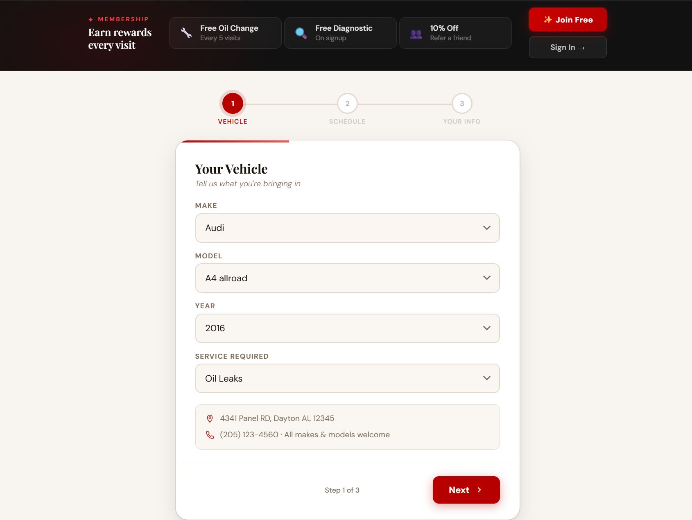
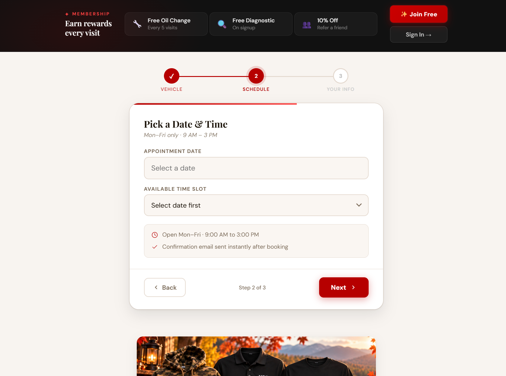
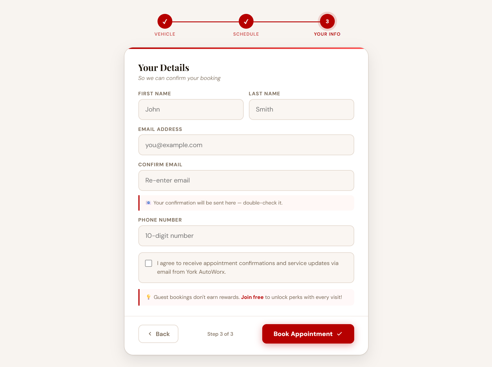

### Customer portal

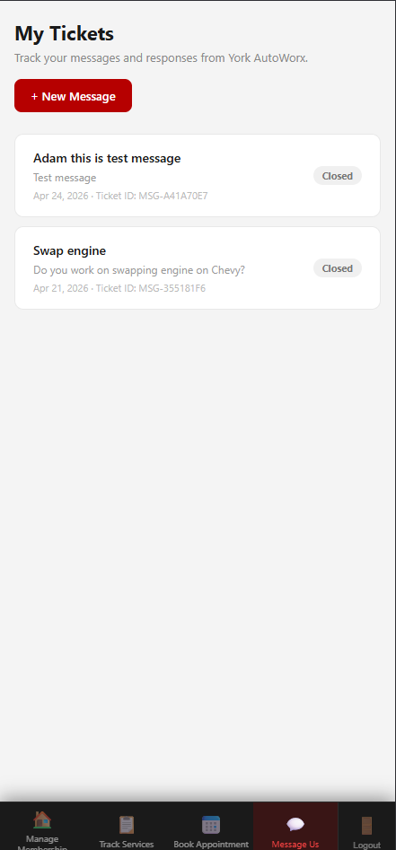
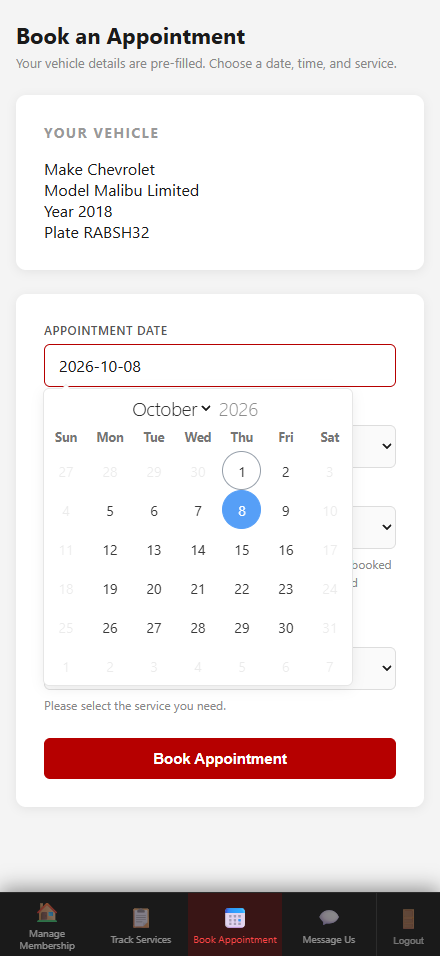
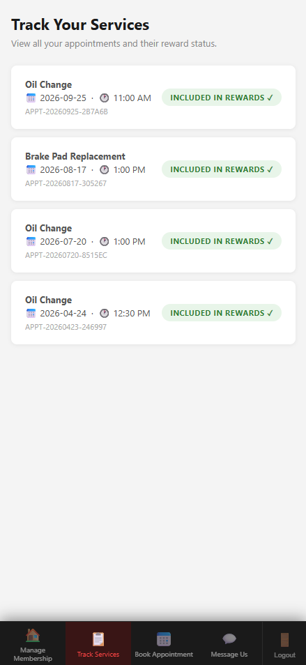
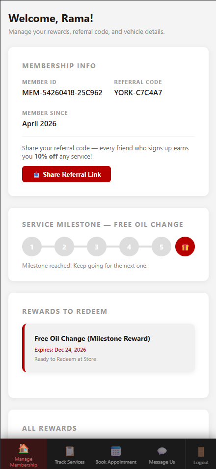

### Staff dashboard

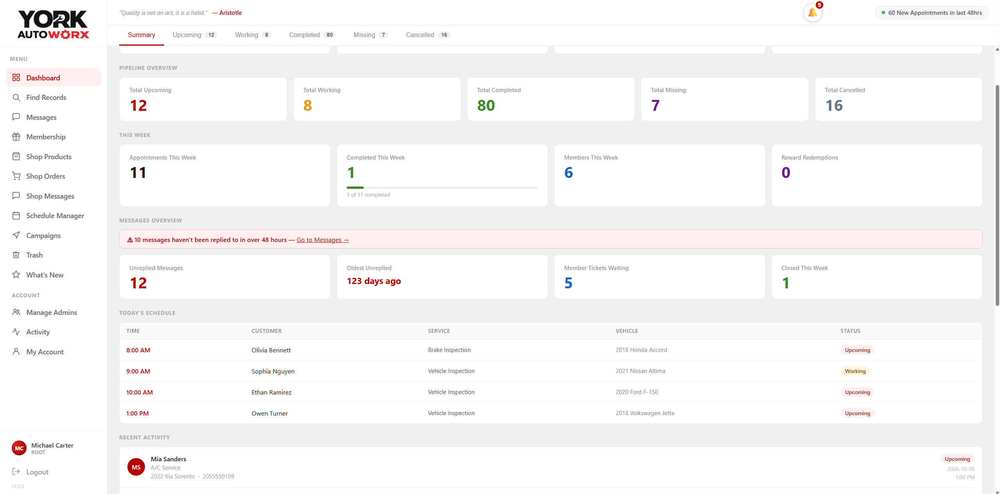

### Real-time updates

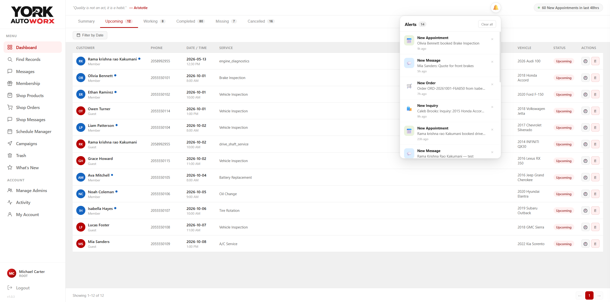

### Online checkout

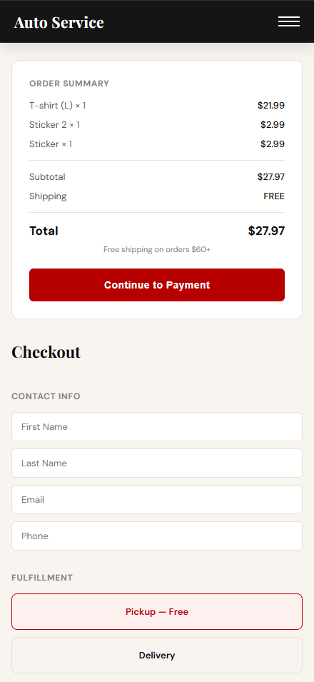

### Messaging and email


### Shop and order management

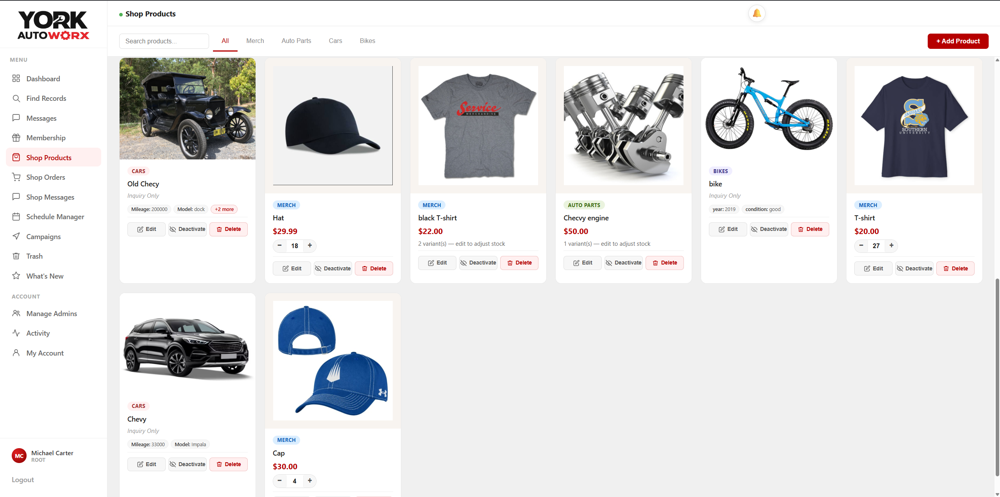
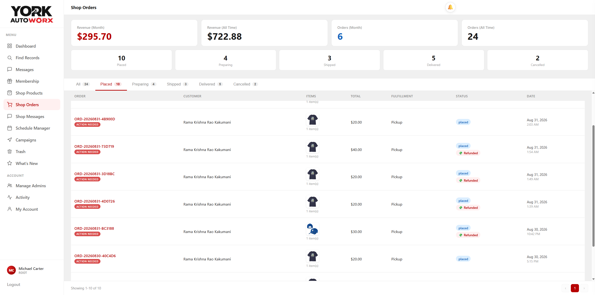

### Email campaign analytics

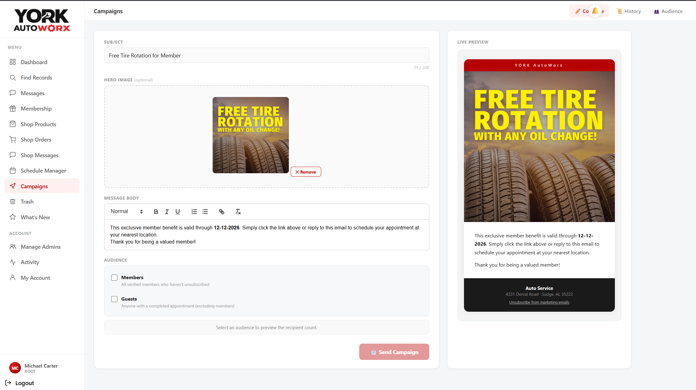


---

## Architecture

The application is built as a Node.js/Express web application backed by MongoDB.

```text
                         ┌─────────────────────┐
                         │      Customers      │
                         │  Web / Member Portal│
                         └──────────┬──────────┘
                                    │
                                    ▼
┌──────────────────────────────────────────────────────────┐
│                    Node.js / Express                     │
│                                                          │
│  Authentication   Appointments   Messaging   Commerce   │
│  Memberships      Admin APIs      Webhooks    Campaigns  │
└───────────────┬──────────────┬──────────────┬────────────┘
                │              │              │
                ▼              ▼              ▼
           ┌─────────┐   ┌──────────┐   ┌─────────────┐
           │ MongoDB │   │ Socket.IO│   │   Stripe    │
           │         │   │          │   │ Checkout &  │
           │ Mongoose│   │ Live     │   │  Webhooks   │
           └─────────┘   │ updates  │   └─────────────┘
                         └──────────┘
                │
                ▼
        ┌─────────────────┐
        │ Scheduler Service│
        │                 │
        │ Reminders       │
        │ No-shows        │
        │ Rewards         │
        │ Cleanup         │
        └─────────────────┘

External services:
Stripe · Brevo · Cloudinary · Railway
```

The main application and scheduler are deployed separately. The scheduler connects to the same database and handles short-lived background jobs independently from the web application.

---

## Technology

### Backend

- JavaScript
- Node.js
- Express 4
- MongoDB
- Mongoose 8
- Socket.IO 4

### Frontend

- Server-rendered HTML
- CSS
- Vanilla JavaScript

### Payments

- Stripe Checkout
- Stripe Tax
- Stripe webhooks

### Email

- Brevo transactional API
- Inbound email parsing
- Email event webhooks
- Transactional and marketing email workflows

### Storage and infrastructure

- Cloudinary
- Railway
- MongoDB-backed sessions
- Environment-based configuration

### Security

- Server-side sessions
- bcrypt password hashing
- Rate limiting
- Token hashing
- Role-based authorization
- Webhook verification
- Input validation
- XSS protection
- Upload validation
- Session revocation

---

# Engineering Highlights

This project became more than a collection of CRUD pages. A number of features required dealing with duplicate requests, concurrent users, third-party webhooks, permissions, and production failures.

## 1. Reliable Stripe order creation

Stripe webhooks can be delivered more than once, so creating an order every time a payment event arrives would create duplicate orders.

I designed the payment flow so that:

1. The server recalculates the cart before checkout.
2. Stripe Checkout is created using server-controlled pricing.
3. The application waits for a verified Stripe webhook before creating the order.
4. The webhook handler verifies the event signature.
5. The application uses database transactions and unique constraints to prevent duplicate order creation.
6. Inventory updates are performed atomically.

This keeps the browser from being the source of truth for payment or order state.

---

## 2. Checkout idempotency

Checkout requests can also be repeated because of retries, double-clicks, network problems, or browser behavior.

The application uses idempotency protection so that the same logical checkout request does not create multiple Stripe sessions.

The important part is that the server does not simply trust a value sent by the browser. The server determines the relevant checkout state and validates the request before creating the payment session.

---

## 3. Real-time staff dashboard

The staff dashboard uses Socket.IO to keep multiple staff members in sync.

When one staff member changes a record, other connected staff can receive a small invalidation event and refresh the affected data.

The client-side synchronization layer also handles:

- Reconnection
- Exponential backoff
- Refreshing data after reconnecting
- Debouncing repeated updates
- Avoiding duplicate refresh requests
- Deferring unnecessary work in hidden browser tabs
- Protecting records currently being edited
- Highlighting changed rows

The goal was not to push the entire database state through WebSockets. Instead, the socket layer tells the client **what changed**, and the client retrieves the current data through the normal API.

---

## 4. Global session revocation

Staff sessions can be revoked without waiting for the normal session expiration.

Each account has a token version that is checked during authentication. Increasing that version invalidates existing sessions for the account.

The same concept is applied to both HTTP requests and WebSocket connections.

This gives staff account changes an immediate effect across the application.

---

## 5. Ticket-based two-way email

Customer communication is connected to internal tickets rather than being treated as unrelated email messages.

The system supports:

- Customer replies
- Staff replies
- Attachments
- Inbound email parsing
- Ticket updates
- Email delivery events
- Unsubscribe handling

Reply addresses contain signed information that allows an incoming email to be associated with the correct ticket without exposing internal identifiers directly.

Inbound messages are also handled idempotently so that the same provider event does not create duplicate messages.

---

## 6. Audit history

Important staff actions are recorded in an append-only audit model.

The audit system records the action, actor, target, timestamp, and relevant metadata while applying data minimization and JSON scrubbing.

This provides a history of important changes without storing unnecessary customer information in the audit records.

---

## 7. Appointment automation

Appointment management is connected to scheduled background work.

The scheduler handles tasks such as:

- Appointment reminders
- No-show processing
- Reward reconciliation
- Reward expiry warnings
- Cleanup work

Appointment state transitions are validated on the server, and scheduled operations use conditional updates so that a record is not processed twice accidentally.

---

# Authentication and Authorization

The application uses server-side sessions rather than storing authentication state in the browser.

The authentication system includes:

- Password hashing with bcrypt
- Session ID regeneration
- MongoDB-backed sessions
- Rolling idle timeouts
- Single-use token handling
- Token hashing
- Login protection and rate limiting
- Account lockout behavior
- Multiple staff permission levels
- Centralized authorization checks
- Session revocation

Staff access is separated into multiple roles rather than relying on one shared administrative login.

Authorization is centralized through permission checks so that sensitive actions are not controlled only by whether someone can reach a particular page.

---

# Security Work

Security was part of the application work throughout development rather than something added only at the end.

Some of the areas I worked on include:

- Server-side input validation
- Query whitelisting
- Input coercion
- Regex escaping
- HTML escaping
- Email header cleaning
- Attachment sandboxing
- Upload validation
- Rate limiting
- Enumeration resistance
- Token hashing
- Atomic token consumption
- Stripe webhook verification
- Server-side pricing
- Checkout idempotency
- Session security
- Role-based authorization
- Data minimization

I also fixed production security issues during development, including unauthenticated administrative routes, unsafe appointment lookups, stored XSS, unverified upload identifiers, and a shared administrative login.

---

# Database Design

MongoDB is used through Mongoose.

The main application contains 16 primary collections and uses several types of indexes depending on the data being stored:

- Unique indexes
- Partial unique indexes
- TTL indexes
- Compound indexes

Transactions are used where multiple related database changes need to succeed together.

For example, order creation and inventory changes are handled together so that the database does not end up with an order that does not match the corresponding inventory state.

The application also uses:

- Pagination
- Cursor-based paging where appropriate
- Lean queries
- Field projections
- Conditional atomic updates
- Soft deletion
- Explicit state transitions

---

# Testing

The project includes HTTP-level integration testing against a dedicated test database.

The automated test suites cover areas such as:

- Authentication
- Administrative operations
- Appointment workflows
- Database behavior
- Concurrent operations
- Race conditions
- Socket connections
- Permissions
- API behavior

There are 16 automated integration suites with roughly 450 assertion call sites and approximately 3,300 lines of test code.

Some tests specifically exercise concurrent operations, including invitation and administrative race conditions.

The project does not currently claim complete automated coverage. Payment checkout, Stripe webhook flows, member authentication, and some booking validation areas still have testing gaps.

That distinction is intentional: I want the portfolio to show what is actually tested rather than implying coverage that does not exist.

---

# Production Deployment

The application runs on Railway with:

- One main web service
- Two scheduled services
- Environment-based secrets
- A dedicated test database
- Production email controls
- Structured console logging

The application uses separate public domains for the main service and shop experience, with a dedicated inbound email subdomain.

Operational safeguards include staff alerts and owner notifications for important events.

The system does not currently use a dedicated APM platform, so production monitoring relies primarily on application logging and operational alerts.

---

# Project Scale

The production application currently includes approximately:

| Area | Size |
|---|---:|
| Route handlers | 175 |
| Express routers | 23 |
| Mongoose models / collections | 16 |
| Server-rendered pages | 49 |
| Live-sync admin pages | 11 |
| Automated integration suites | 16 |
| Assertion call sites | ~450 |
| Server-side JavaScript | ~10.9k lines |
| HTML | ~19k lines |
| CSS | ~14.7k lines |
| Client JavaScript | ~1.2k lines |
| Scheduler JavaScript | ~1.5k lines |
| External service vendors | 4 |

These numbers describe the production codebase represented by the portfolio documentation; they are not presented as performance benchmarks.

---

# Some Problems I Had to Solve

A few of the engineering problems that shaped the application were:

### Duplicate payment webhooks

**Problem:** Payment providers can retry webhook delivery.

**Approach:** Verify the webhook, use database transactions, and enforce uniqueness at the database level.

### Duplicate checkout requests

**Problem:** The same customer action can reach the server more than once.

**Approach:** Add server-side idempotency protection instead of relying on the browser.

### Multiple staff editing the same dashboard

**Problem:** Live updates can overwrite someone else's unsaved work.

**Approach:** Use lightweight invalidation events and defer refreshes while a record is being edited.

### Immediate account revocation

**Problem:** Disabling an account should invalidate active sessions.

**Approach:** Use per-account token versions across HTTP and WebSocket authentication.

### Connecting inbound email to the correct ticket

**Problem:** A customer reply needs to reach the correct conversation without exposing internal identifiers.

**Approach:** Use signed reply addresses and idempotent inbound processing.

### Removing a shared staff login

**Problem:** Replacing an existing shared login could disrupt active staff.

**Approach:** Introduce individual accounts and permissions while preserving a controlled migration path.

---

# What I Owned

I was responsible for the system end to end.

That included:

- Application architecture
- Backend development
- Database design
- Customer-facing pages
- Staff dashboard
- Authentication and authorization
- Stripe integration
- Email platform
- Real-time updates
- Membership and rewards
- Background jobs
- Security hardening
- Integration testing
- Production deployment
- Production maintenance and troubleshooting

This project gave me experience working on the parts of a production application that are easy to miss in a small demo project: retries, permissions, concurrent users, third-party failures, data consistency, background processing, and operational issues.

---

# Portfolio Documentation

More detailed technical write-ups are available in the `docs/` directory.

- **Architecture** — application structure and major components
- **Authentication** — sessions, roles, permissions, and revocation
- **Payments** — Stripe checkout, webhooks, idempotency, and order creation
- **Real-Time Updates** — Socket.IO architecture and client synchronization
- **Email System** — transactional email, inbound replies, campaigns, and delivery events
- **Background Jobs** — scheduled processing and failure handling
- **Database Design** — collections, indexes, transactions, and state transitions
- **Testing** — integration testing strategy and coverage
- **Security** — security controls and lessons from production issues
- **Production Operations** — deployment and operational practices
- **Engineering Decisions** — important design decisions and tradeoffs

---

# About This Portfolio Version

The original application is a private production system.

This portfolio version is intentionally sanitized. It does not include:

- Production credentials
- Environment files
- Customer information
- Private business data
- Private recovery scripts
- Production endpoint details
- Sensitive business rules
- Original production Git history

The purpose of this repository is to demonstrate the engineering work, architecture, design decisions, and problems I solved without exposing private production information.